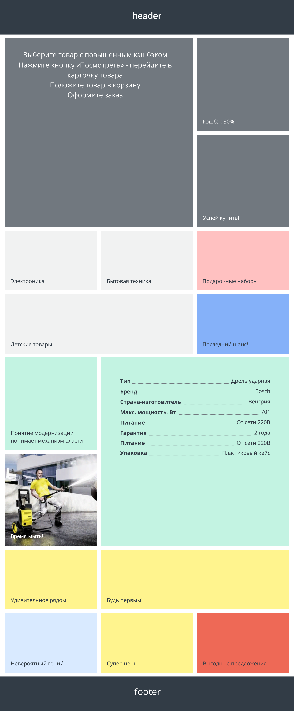
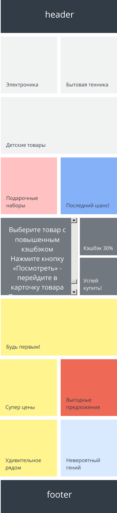

# Тестовое задание - frontend (плитка)

## Задание

На макетах с плитками представлены крайние состояния: 768 и 320

На 480 переходим от сетки 768 к 320

Серый и зеленый квадраты - квадраты при любом разрешении

